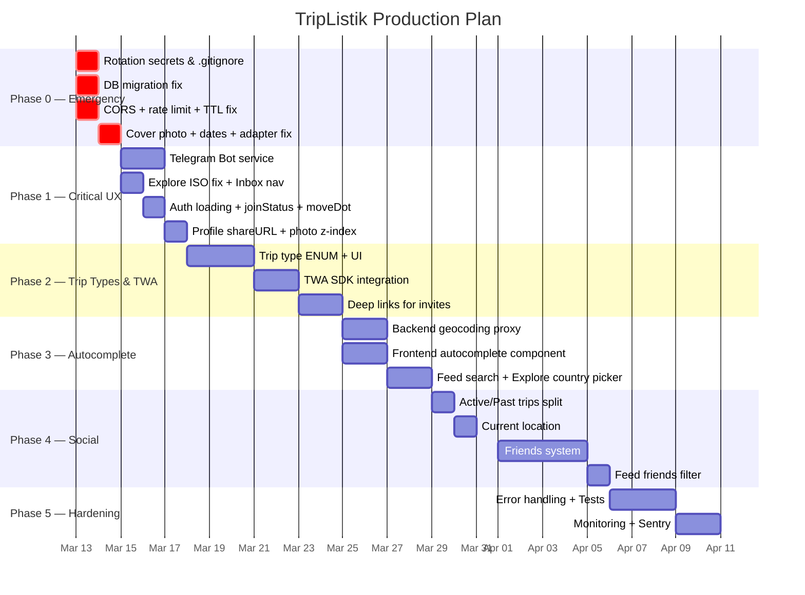

# TripListik — Full Code Review & Production Plan

---

## ШАГ 1 — ДЕТАЛЬНЫЙ CODE REVIEW

> [!CAUTION]
> **Секреты в репозитории!** [.env](file:///home/critiq/development/trip-listik/.env) содержит живой `BOT_TOKEN` и `API_KEY_AI`. Необходимо немедленно ротировать все ключи и добавить [.env](file:///home/critiq/development/trip-listik/.env) в [.gitignore](file:///home/critiq/development/trip-listik/.gitignore).

---

### 🏗️ Backend (Go / Fiber / GORM)

---

#### 🔴 Critical Bug — #B1: Telegram Bot сервис полностью отсутствует

| | |
|---|---|
| **Файл** | Отсутствует (нет файла) |
| **Описание** | Нет интеграции с Telegram Bot API. Инвайты сохраняются в БД ([invites.go:91](file:///home/critiq/development/trip-listik/backend/internal/httpapi/handlers/invites.go#L91)), но уведомления пользователю в Telegram НЕ отправляются |
| **Последствие** | Пользователь получает инвайт, но не узнает об этом, пока не откроет mini app вручную. То же касается approve/reject join request и новых комментариев |
| **Решение** | Создать `internal/telegram/bot.go` с клиентом Bot API (`sendMessage`). Вызывать при: [InviteUser](file:///home/critiq/development/trip-listik/backend/internal/httpapi/handlers/invites.go#33-98), [ApproveJoin](file:///home/critiq/development/trip-listik/backend/internal/httpapi/handlers/members.go#149-201), `CreateComment` |

---

#### 🔴 Critical Bug — #B2: Exposed secrets в [.env](file:///home/critiq/development/trip-listik/.env)

| | |
|---|---|
| **Файл** | [.env](file:///home/critiq/development/trip-listik/.env) (строки 3-4) |
| **Описание** | `BOT_TOKEN=7602079357:AAH4huoH...` и `API_KEY_AI=gsk_Bqcq2za...` лежат в открытом файле. [.gitignore](file:///home/critiq/development/trip-listik/.gitignore) не содержит [.env](file:///home/critiq/development/trip-listik/.env) |
| **Последствие** | Компрометация бота и AI ключа. Бот может быть перехвачен |
| **Решение** | Немедленно ротировать оба ключа. Добавить [.env](file:///home/critiq/development/trip-listik/.env) в [.gitignore](file:///home/critiq/development/trip-listik/.gitignore). Использовать только переменные окружения в production |

---

#### 🔴 Critical Bug — #B3: DB миграция не содержит `bio`, `is_public`, `user_wishlist_items`

| | |
|---|---|
| **Файл** | [0001_init.up.sql](file:///home/critiq/development/trip-listik/backend/migrations/0001_init.up.sql) |
| **Описание** | Таблица `users` не содержит полей `bio` и `is_public`, хотя модель Go ([models.go:16-17](file:///home/critiq/development/trip-listik/backend/internal/store/models/models.go#L16-L17)) и фронт ([profile/+page.svelte:41-42](file:///home/critiq/development/trip-listik/frontend/src/routes/profile/+page.svelte#L41-L42)) их используют. Таблица `user_wishlist_items` тоже отсутствует в миграции |
| **Последствие** | При чистом деплое профиль и wishlist не работают. GORM может автомигрировать, но это непредсказуемо |
| **Решение** | Создать `0002_add_bio_wishlist.up.sql` с `ALTER TABLE users ADD COLUMN bio text, ADD COLUMN is_public boolean DEFAULT true; CREATE TABLE user_wishlist_items (...)` |

---

#### 🔴 Critical Bug — #B4: CORS_ORIGINS=* в production

| | |
|---|---|
| **Файл** | [config.go:44](file:///home/critiq/development/trip-listik/backend/internal/config/config.go#L44), [docker-compose.yml:35](file:///home/critiq/development/trip-listik/docker-compose.yml#L35) |
| **Описание** | По дефолту `CORS_ORIGINS` = `*`. В [docker-compose.yml](file:///home/critiq/development/trip-listik/docker-compose.yml) тоже `CORS_ORIGINS: ${CORS_ORIGINS:-*}` |
| **Последствие** | Любой сайт может делать запросы к API от имени пользователя. XSS-атака с любого домена получает полный доступ |
| **Решение** | Поставить `CORS_ORIGINS` = конкретный домен фронтенда (e.g. `https://triplistik.vercel.app`). Добавить валидацию в [ValidateAPI()](file:///home/critiq/development/trip-listik/backend/internal/config/config.go#65-77) |

---

#### 🟠 Feature Gap — #B5: `trip_visibility` ENUM только `public`/`private`

| | |
|---|---|
| **Файл** | [0001_init.up.sql:4](file:///home/critiq/development/trip-listik/backend/migrations/0001_init.up.sql#L4) |
| **Описание** | БД ENUM `trip_visibility` содержит только [('public', 'private')](file:///home/critiq/development/trip-listik/backend/internal/server/server.go#16-50). Нет значений `tour`, `group` и др. |
| **Последствие** | Невозможно создать тур или групповую поездку с отдельной логикой видимости |
| **Решение** | Расширить ENUM: `ALTER TYPE trip_visibility ADD VALUE 'tour'; ALTER TYPE trip_visibility ADD VALUE 'group';` + добавить UI выбора на фронте |

---

#### 🟠 Feature Gap — #B6: Нет rate limiting на API

| | |
|---|---|
| **Файл** | [server.go](file:///home/critiq/development/trip-listik/backend/internal/server/server.go) |
| **Описание** | Отсутствует middleware для rate limiting. Все эндпойнты доступны без ограничений |
| **Последствие** | API уязвимо к brute-force и DDoS. Один клиент может перегрузить сервер |
| **Решение** | Добавить `github.com/gofiber/fiber/v2/middleware/limiter` с 100 req/min для публичных и 200 req/min для auth endpoints |

---

#### 🟡 UX Issue — #B7: Init data TTL = 5 минут

| | |
|---|---|
| **Файл** | [telegram.go:43](file:///home/critiq/development/trip-listik/backend/internal/auth/telegram.go#L43) |
| **Описание** | `const maxAuthAge = 5 * time.Minute`. Telegram может подписать init data за несколько секунд до отправки, но mobile клиенты могут задерживать запрос |
| **Последствие** | На медленных сетях или при background/foreground переключениях пользователи получают "init data expired" |
| **Решение** | Увеличить до `15 * time.Minute` или `30 * time.Minute`. Auth handler ([auth.go:48-50](file:///home/critiq/development/trip-listik/backend/internal/httpapi/handlers/auth.go#L48-L50)) использует JWT с 2h TTL, так что init data TTL не влияет на безопасность сессии |

---

#### 🟡 UX Issue — #B8: [RefreshToken](file:///home/critiq/development/trip-listik/backend/internal/store/models/models.go#131-140) table отсутствует в миграции

| | |
|---|---|
| **Файл** | [0001_init.up.sql](file:///home/critiq/development/trip-listik/backend/migrations/0001_init.up.sql) |
| **Описание** | Модель [RefreshToken](file:///home/critiq/development/trip-listik/backend/internal/store/models/models.go#131-140) существует ([models.go:131-139](file:///home/critiq/development/trip-listik/backend/internal/store/models/models.go#L131-L139)), но таблица `refresh_tokens` не создается в миграции |
| **Последствие** | Логин ломается при чистой миграции без GORM auto-migrate |
| **Решение** | Добавить `CREATE TABLE refresh_tokens (...)` в миграцию |

---

#### ⚪ Tech Debt — #B9: `BOT_TOKEN` в config, но нигде не используется

| | |
|---|---|
| **Файл** | [config.go](file:///home/critiq/development/trip-listik/backend/internal/config/config.go) |
| **Описание** | [.env](file:///home/critiq/development/trip-listik/.env) содержит `BOT_TOKEN`, но [Config](file:///home/critiq/development/trip-listik/backend/internal/config/config.go#11-25) struct его не читает. [TelegramWebAppSecret](file:///home/critiq/development/trip-listik/backend/internal/auth/telegram.go#87-92) скорее всего тоже должен быть `BOT_TOKEN` |
| **Последствие** | Путаница между `BOT_TOKEN` и `TELEGRAM_WEBAPP_SECRET`. Потенциально используются разные значения |
| **Решение** | Вычислить webapp secret из `BOT_TOKEN` автоматически. Добавить `BotToken` в Config и создать бот-сервис |

---

### 🖥️ Frontend (SvelteKit 5 / TypeScript)

---

#### 🔴 Critical Bug — #F1: Cover photo никогда не загружается при создании трипа

| | |
|---|---|
| **Файл** | [create/+page.svelte:44](file:///home/critiq/development/trip-listik/frontend/src/routes/create/+page.svelte#L44) |
| **Описание** | Пользователь выбирает фото (строка 22-24: `coverPhotoPreview = URL.createObjectURL(file)`), но при POST отправляется `cover_photo_url: null` |
| **Последствие** | Cover photo всегда null. Все карточки трипов в фиде без обложки |
| **Решение** | Перед созданием трипа — вызвать presign upload, загрузить файл в Supabase, получить URL и подставить в `cover_photo_url` |

---

#### 🔴 Critical Bug — #F2: Захардкоженные даты из 2023 года

| | |
|---|---|
| **Файл** | [step-2/+page.svelte:7-8](file:///home/critiq/development/trip-listik/frontend/src/routes/create/step-2/+page.svelte#L7-L8) |
| **Описание** | `let startDate = new Date(2023, 9, 12);` и `let endDate = new Date(2023, 9, 18);` — дефолтные даты в прошлом |
| **Последствие** | Если пользователь не меняет даты, трип создаётся с датами из октября 2023. Пользователь видит прошедшую поездку |
| **Решение** | Инициализировать как `null`, или dynamically: `const today = new Date(); startDate = today; endDate = new Date(today.getTime() + 7 * 86400000)` |

---

#### 🔴 Critical Bug — #F3: `adapter-vercel` vs Docker `node build`

| | |
|---|---|
| **Файл** | [svelte.config.js:1](file:///home/critiq/development/trip-listik/frontend/svelte.config.js#L1), [Dockerfile:20](file:///home/critiq/development/trip-listik/frontend/Dockerfile#L20) |
| **Описание** | [svelte.config.js](file:///home/critiq/development/trip-listik/frontend/svelte.config.js) использует `@sveltejs/adapter-vercel`, но [Dockerfile](file:///home/critiq/development/trip-listik/backend/Dockerfile) запускает `node build` (ожидая node-adapter output) |
| **Последствие** | Docker-сборка создает serverless-формат Vercel, но пытается запустить его как node-сервер. Контейнер frontend не работает |
| **Решение** | Если Vercel — основной деплой, Dockerfile удалить или переключить на `adapter-node` для Docker. Для Vercel адаптер оставить |

---

#### 🟠 Feature Gap — #F4: Explore page отправляет region names вместо ISO кодов

| | |
|---|---|
| **Файл** | [explore/+page.svelte:76-80](file:///home/critiq/development/trip-listik/frontend/src/routes/explore/+page.svelte#L76-L80) |
| **Описание** | Select отправляет `value="europe"`, `value="asia"`, `value="north-america"`. Backend ([trips.go:164](file:///home/critiq/development/trip-listik/backend/internal/store/trips.go#L164)) фильтрует по `country_code = ?` ожидая ISO-код (DE, FR, JP) |
| **Последствие** | Фильтр по стране в Explore не работает — всегда 0 результатов |
| **Решение** | Заменить на реальные ISO-коды стран, или сделать region -> country codes маппинг на бэкенде (WHERE `country_code IN (...)`) |

---

#### 🟠 Feature Gap — #F5: Inbox page не в BottomNav

| | |
|---|---|
| **Файл** | [BottomNav.svelte:6-12](file:///home/critiq/development/trip-listik/frontend/src/lib/components/BottomNav.svelte#L6-L12) |
| **Описание** | `BottomNav` содержит 5 табов: Feed, Trips, Create, Explore, Profile. Inbox недоступен из навигации |
| **Последствие** | Кнопка уведомлений в topbar ([+page.svelte:83-85](file:///home/critiq/development/trip-listik/frontend/src/routes/+page.svelte#L83-L85)) — просто `<button>` без `href` или `onclick`. Пользователь не может попасть в inbox |
| **Решение** | Сделать notification icon кликабельным (`<a href="/inbox">`) или добавить inbox в BottomNav |

---

#### 🟠 Feature Gap — #F6: [ensureAuth](file:///home/critiq/development/trip-listik/frontend/src/lib/auth.ts#8-40) без `await` в [+layout.svelte](file:///home/critiq/development/trip-listik/frontend/src/routes/+layout.svelte)

| | |
|---|---|
| **Файл** | [+layout.svelte:12-14](file:///home/critiq/development/trip-listik/frontend/src/routes/+layout.svelte#L12-L14) |
| **Описание** | `onMount(() => { ensureAuth($page.url.pathname); });` — [ensureAuth](file:///home/critiq/development/trip-listik/frontend/src/lib/auth.ts#8-40) — async function, но вызывается без `await` |
| **Последствие** | Пользователь видит защищенный контент на долю секунды до редиректа на `/auth`. Flash of unauthorized content |
| **Решение** | Добавить loading state: показывать skeleton/spinner до завершения auth check. Или использовать SvelteKit [load](file:///home/critiq/development/trip-listik/frontend/src/lib/api.ts#112-125) function для server-side redirect |

---

#### 🟡 UX Issue — #F7: `joinStatus` показывает raw API strings

| | |
|---|---|
| **Файл** | [trips/[id]/+page.svelte:50,449-451](file:///home/critiq/development/trip-listik/frontend/src/routes/trips/%5Bid%5D/+page.svelte#L50) |
| **Описание** | После join, кнопка показывает `joinStatus` напрямую: `'joined'`, `'pending'`, `'already_member'` — без локализации |
| **Последствие** | Пользователь видит технические строки вместо человекочитаемых: "pending" вместо "Request sent ✓" |
| **Решение** | Маппинг статусов: `{ joined: 'Joined ✓', pending: 'Request sent', already_member: 'Already a member' }` |

---

#### 🟡 UX Issue — #F8: `BottomNav.moveDot()` — race condition

| | |
|---|---|
| **Файл** | [BottomNav.svelte:31-43](file:///home/critiq/development/trip-listik/frontend/src/lib/components/BottomNav.svelte#L31-L43) |
| **Описание** | `moveDot()` вызывается в `onMount` и `$effect`. Используется `getBoundingClientRect()`, но layout может быть не завершен |
| **Последствие** | Зелёная точка может оказаться не под активным табом при первом рендере |
| **Решение** | Уже обёрнуто в `requestAnimationFrame` при mount — это частично решает. Но `$effect` не имеет rAF обёртки. Добавить `requestAnimationFrame(moveDot)` в `$effect` |

---

#### 🟡 UX Issue — #F9: Profile shareURL неверен в TWA контексте

| | |
|---|---|
| **Файл** | [profile/+page.svelte:44](file:///home/critiq/development/trip-listik/frontend/src/routes/profile/+page.svelte#L44) |
| **Описание** | `shareURL = window.location.origin + '/profile/' + user.id` — внутри Telegram WebApp `window.location.origin` будет `https://...vercel.app` |
| **Последствие** | URL для шеринга ведёт на веб-версию, а не на deep link бота. Нужен `t.me/bot?startapp=profile_xxx` |
| **Решение** | Для Telegram: генерировать `https://t.me/<botname>?startapp=profile_${user.id}`. Для web: оставить текущий URL |

---

#### 🟡 UX Issue — #F10: Нет использования TWA SDK (MainButton, BackButton)

| | |
|---|---|
| **Файл** | [telegram.ts](file:///home/critiq/development/trip-listik/frontend/src/lib/telegram.ts) |
| **Описание** | TWA SDK используется только для `initData` и [expand()](file:///home/critiq/development/trip-listik/frontend/src/lib/telegram.ts#7-12). `MainButton`, `BackButton`, `HapticFeedback` не задействованы |
| **Последствие** | Нативный UX Telegram не используется. Нет нативной кнопки "Назад" и "Создать" |
| **Решение** | Использовать `Telegram.WebApp.MainButton` на страницах создания, `BackButton` для навигации назад, `HapticFeedback` для тактильной обратной связи |

---

#### 🔵 Performance — #F11: N+1 запросы в feed/explore

| | |
|---|---|
| **Файл** | [feed.go:77-89](file:///home/critiq/development/trip-listik/backend/internal/httpapi/handlers/feed.go#L77-L89) |
| **Описание** | После получения трипов, делается два отдельных запроса (`GetTripMemberCounts`, `GetTripVoteStats`) с массивом ID |
| **Последствие** | 3 запроса к БД на каждый запрос фида — приемлемо сейчас, но не оптимально |
| **Решение** | Объединить в один SQL с `LEFT JOIN` и `GROUP BY`, или использовать материализованные view |

---

#### ⚪ Tech Debt — #F12: Нет автокомплита городов

| | |
|---|---|
| **Файл** | [create/+page.svelte:77](file:///home/critiq/development/trip-listik/frontend/src/routes/create/+page.svelte#L77) |
| **Описание** | Destination — простой текстовый input без автокомплита |
| **Последствие** | Пользователи вводят города с опечатками, нет стандартизации (country_code тоже вводится вручную) |
| **Решение** | Интегрировать Nominatim (бесплатный) или Mapbox API для autocomplete. Автоматически заполнять `country_code` и `city` |

---

#### ⚪ Tech Debt — #F13: Photo grid opacity/z-index конфликт

| | |
|---|---|
| **Файл** | [trips/[id]/+page.svelte:656-660](file:///home/critiq/development/trip-listik/frontend/src/routes/trips/%5Bid%5D/+page.svelte#L656-L660) |
| **Описание** | `.trip-img` начинается с `opacity: 0` и переходит к `opacity: 1` через `.loaded` класс. Но `img-skeleton` позиционирован `position: absolute; inset: 0` с тем же z-index |
| **Последствие** | При загрузке фото skeleton может перекрывать изображение, создавая мерцание |
| **Решение** | Добавить `z-index: 1` к `.trip-img.loaded` и `z-index: 0` к `.img-skeleton`, скрывать skeleton при `.loaded` |

---

### 📋 Сводная таблица

| # | Категория | Компонент | Описание |
|---|-----------|-----------|----------|
| B1 | 🔴 Critical | Backend | Нет Telegram Bot сервиса — инвайты молча сохраняются |
| B2 | 🔴 Critical | Infra | Exposed BOT_TOKEN и API_KEY_AI в [.env](file:///home/critiq/development/trip-listik/.env) |
| B3 | 🔴 Critical | Backend | DB migration missing: `bio`, `is_public`, `user_wishlist_items`, `refresh_tokens` |
| B4 | 🔴 Critical | Backend | CORS=* в production |
| B5 | 🟠 Gap | Backend | `trip_visibility` ENUM: нет `tour`, `group` |
| B6 | 🟠 Gap | Backend | Нет rate limiting |
| B7 | 🟡 UX | Backend | Init data TTL 5 min — слишком мало |
| B8 | 🟡 UX | Backend | `refresh_tokens` таблица не в миграции |
| B9 | ⚪ Debt | Backend | `BOT_TOKEN` не в Config struct |
| F1 | 🔴 Critical | Frontend | Cover photo = null при создании |
| F2 | 🔴 Critical | Frontend | Dates hardcoded to October 2023 |
| F3 | 🔴 Critical | Frontend | adapter-vercel vs `node build` в Docker |
| F4 | 🟠 Gap | Frontend | Explore: region names vs ISO codes |
| F5 | 🟠 Gap | Frontend | Inbox недоступен из навигации |
| F6 | 🟠 Gap | Frontend | [ensureAuth](file:///home/critiq/development/trip-listik/frontend/src/lib/auth.ts#8-40) без await — flash of content |
| F7 | 🟡 UX | Frontend | joinStatus shows raw API strings |
| F8 | 🟡 UX | Frontend | BottomNav dot race condition |
| F9 | 🟡 UX | Frontend | shareURL wrong in TWA context |
| F10 | 🟡 UX | Frontend | TWA SDK not utilized (MainButton, BackButton) |
| F11 | 🔵 Perf | Backend | 3 DB queries per feed request |
| F12 | ⚪ Debt | Frontend | No city autocomplete |
| F13 | ⚪ Debt | Frontend | Photo grid z-index conflict |

---

## ШАГ 2 — PRODUCTION PLAN

### Фаза 0: Экстренные исправления (1–2 дня)

> [!CAUTION]
> Эту фазу нужно сделать **ДО** любого деплоя.

| # | Задача | Файлы | Оценка |
|---|--------|-------|--------|
| 0.1 | Ротировать BOT_TOKEN и API_KEY_AI. Добавить [.env](file:///home/critiq/development/trip-listik/.env) в [.gitignore](file:///home/critiq/development/trip-listik/.gitignore) | [.env](file:///home/critiq/development/trip-listik/.env), [.gitignore](file:///home/critiq/development/trip-listik/.gitignore) | 15 мин |
| 0.2 | Создать миграцию `0002`: `bio`, `is_public` для users, таблица `user_wishlist_items`, таблица `refresh_tokens` | `migrations/0002_*.sql` | 1ч |
| 0.3 | Зафиксировать `CORS_ORIGINS` = конкретный домен вместо `*` | [config.go](file:///home/critiq/development/trip-listik/backend/internal/config/config.go), [docker-compose.yml](file:///home/critiq/development/trip-listik/docker-compose.yml) | 15 мин |
| 0.4 | Исправить init data TTL: 5 мин → 30 мин | `telegram.go:43` | 5 мин |
| 0.5 | Fix cover photo upload: presign + upload + URL при создании трипа | [create/+page.svelte](file:///home/critiq/development/trip-listik/frontend/src/routes/create/+page.svelte) | 2ч |
| 0.6 | Fix hardcoded dates → `null` или today+7d | `step-2/+page.svelte:7-8` | 10 мин |
| 0.7 | Resolve adapter conflict: если Vercel = primary → adapter-vercel, удалить Docker frontend. Если Docker → `adapter-node` | [svelte.config.js](file:///home/critiq/development/trip-listik/frontend/svelte.config.js), [Dockerfile](file:///home/critiq/development/trip-listik/backend/Dockerfile) | 30 мин |
| 0.8 | Добавить rate limiting middleware | [server.go](file:///home/critiq/development/trip-listik/backend/internal/server/server.go) | 30 мин |

---

### Фаза 1: Критичные фичи и UX (3–5 дней)

| # | Задача | Файлы | Оценка |
|---|--------|-------|--------|
| 1.1 | **Telegram Bot сервис**: создать `internal/telegram/bot.go` — обёртка над Bot API `sendMessage`. Отправлять уведомления: invite, approve, comment | `bot.go` (NEW), [invites.go](file:///home/critiq/development/trip-listik/backend/internal/store/invites.go), [members.go](file:///home/critiq/development/trip-listik/backend/internal/store/members.go), [comments.go](file:///home/critiq/development/trip-listik/backend/internal/store/comments.go) | 4ч |
| 1.2 | Добавить `BOT_TOKEN` в Config, использовать для webapp secret вычисления | [config.go](file:///home/critiq/development/trip-listik/backend/internal/config/config.go) | 30 мин |
| 1.3 | Fix Explore: замена region names на ISO-коды (или маппинг на бэке) | [explore/+page.svelte](file:///home/critiq/development/trip-listik/frontend/src/routes/explore/+page.svelte), [trips.go](file:///home/critiq/development/trip-listik/backend/internal/store/trips.go) | 1ч |
| 1.4 | Inbox: сделать notification icon в topbar кликабельным → `/inbox` | [+page.svelte](file:///home/critiq/development/trip-listik/frontend/src/routes/+page.svelte), [BottomNav.svelte](file:///home/critiq/development/trip-listik/frontend/src/lib/components/BottomNav.svelte) (опционально) | 15 мин |
| 1.5 | Fix [ensureAuth](file:///home/critiq/development/trip-listik/frontend/src/lib/auth.ts#8-40): добавить loading state до завершения auth | [+layout.svelte](file:///home/critiq/development/trip-listik/frontend/src/routes/+layout.svelte), [auth.ts](file:///home/critiq/development/trip-listik/frontend/src/lib/auth.ts) | 1ч |
| 1.6 | Локализация `joinStatus`: маппинг raw → human-readable | `trips/[id]/+page.svelte` | 15 мин |
| 1.7 | Fix `moveDot()` race: обернуть в `requestAnimationFrame` внутри `$effect` | [BottomNav.svelte](file:///home/critiq/development/trip-listik/frontend/src/lib/components/BottomNav.svelte) | 10 мин |
| 1.8 | Fix profile shareURL: TWA deep link `t.me/bot?startapp=profile_xxx` | [profile/+page.svelte](file:///home/critiq/development/trip-listik/frontend/src/routes/profile/+page.svelte) | 30 мин |
| 1.9 | Fix photo grid z-index конфликт | `trips/[id]/+page.svelte` (CSS) | 15 мин |

---

### Фаза 2: Trip Types & TWA Integration (5–7 дней)

| # | Задача | Файлы | Оценка |
|---|--------|-------|--------|
| 2.1 | Расширить `trip_visibility` ENUM: `tour`, `group` | Миграция, [models.go](file:///home/critiq/development/trip-listik/backend/internal/store/models/models.go) | 1ч |
| 2.2 | UI для выбора типа трипа (step-2 или новый шаг) | [step-2/+page.svelte](file:///home/critiq/development/trip-listik/frontend/src/routes/create/step-2/+page.svelte) или новый компонент | 3ч |
| 2.3 | Backend логика для trip types (tour = публичный read-only, group = private + invite-only) | [trips.go](file:///home/critiq/development/trip-listik/backend/internal/store/trips.go), [members.go](file:///home/critiq/development/trip-listik/backend/internal/store/members.go) | 3ч |
| 2.4 | TWA SDK: MainButton на create/step-* pages | [telegram.ts](file:///home/critiq/development/trip-listik/frontend/src/lib/telegram.ts), create pages | 2ч |
| 2.5 | TWA SDK: BackButton на вложенных страницах | [telegram.ts](file:///home/critiq/development/trip-listik/frontend/src/lib/telegram.ts), [+layout.svelte](file:///home/critiq/development/trip-listik/frontend/src/routes/+layout.svelte) | 1ч |
| 2.6 | TWA SDK: HapticFeedback для vote, join, like | [telegram.ts](file:///home/critiq/development/trip-listik/frontend/src/lib/telegram.ts), trip detail | 1ч |
| 2.7 | Deep links: `t.me/bot?startapp=invite_xxx` для инвайтов | `bot.go`, новый route `/invite/[code]` | 4ч |

---

### Фаза 3: City Autocomplete & Search (3–5 дней)

| # | Задача | Файлы | Оценка |
|---|--------|-------|--------|
| 3.1 | Backend proxy для Nominatim/Mapbox geocoding API | `internal/httpapi/handlers/geocode.go` (NEW) | 3ч |
| 3.2 | Frontend autocomplete component | `lib/components/CityAutocomplete.svelte` (NEW) | 4ч |
| 3.3 | Интеграция в create/+page.svelte и explore | [create/+page.svelte](file:///home/critiq/development/trip-listik/frontend/src/routes/create/+page.svelte), [explore/+page.svelte](file:///home/critiq/development/trip-listik/frontend/src/routes/explore/+page.svelte) | 2ч |
| 3.4 | Поиск по ключевым словам на Feed page (переиспользовать search из Explore) | [+page.svelte](file:///home/critiq/development/trip-listik/frontend/src/routes/+page.svelte) (feed), [feed.go](file:///home/critiq/development/trip-listik/backend/internal/httpapi/handlers/feed.go) | 2ч |
| 3.5 | Замена region filter в Explore на country picker с автокомплитом | [explore/+page.svelte](file:///home/critiq/development/trip-listik/frontend/src/routes/explore/+page.svelte) | 2ч |

---

### Фаза 4: Social Features (7–10 дней)

| # | Задача | Файлы | Оценка |
|---|--------|-------|--------|
| 4.1 | Разделение Active/Past trips в профиле | [profile/+page.svelte](file:///home/critiq/development/trip-listik/frontend/src/routes/profile/+page.svelte), backend: уже есть [ListUserTripsByStatus](file:///home/critiq/development/trip-listik/backend/internal/store/trips.go#62-86) | 2ч |
| 4.2 | "Где сейчас ты": текущая локация в профиле (текстовое поле или геолокация) | [models.go](file:///home/critiq/development/trip-listik/backend/internal/store/models/models.go) (add `current_location`), [profile.go](file:///home/critiq/development/trip-listik/backend/internal/httpapi/handlers/profile.go), [profile/+page.svelte](file:///home/critiq/development/trip-listik/frontend/src/routes/profile/+page.svelte) | 3ч |
| 4.3 | Followers/friends таблица + API endpoints | Миграция, `internal/store/friends.go` (NEW), handlers | 6ч |
| 4.4 | Friends list в Profile page | [profile/+page.svelte](file:///home/critiq/development/trip-listik/frontend/src/routes/profile/+page.svelte) | 3ч |
| 4.5 | Feed filter "Friends" — использовать friends list вместо trip members | `store/trips.go:ListFriendTrips`, [feed.go](file:///home/critiq/development/trip-listik/backend/internal/httpapi/handlers/feed.go) | 2ч |
| 4.6 | Skeleton loader для trip detail page | `trips/[id]/+page.svelte` | 1ч |

---

### Фаза 5: Polish & Production Hardening (3–5 дней)

| # | Задача | Файлы | Оценка |
|---|--------|-------|--------|
| 5.1 | Structured error handling: wrap all errors with context | Все handlers | 2ч |
| 5.2 | Integration tests для auth flow | `auth_test.go` | 3ч |
| 5.3 | E2E smoke tests (health endpoint, auth, create trip) | Новый `e2e/` dir | 4ч |
| 5.4 | DB connection pooling + query optimization | [db.go](file:///home/critiq/development/trip-listik/backend/internal/db/db.go), [store.go](file:///home/critiq/development/trip-listik/backend/internal/store/store.go) | 2ч |
| 5.5 | Monitoring: Prometheus metrics endpoint | [server.go](file:///home/critiq/development/trip-listik/backend/internal/server/server.go) | 2ч |
| 5.6 | Sentry/error reporting integration | [server.go](file:///home/critiq/development/trip-listik/backend/internal/server/server.go), frontend `hooks.ts` | 2ч |
| 5.7 | Docker compose health checks для frontend | [docker-compose.yml](file:///home/critiq/development/trip-listik/docker-compose.yml) | 15 мин |

---

### Визуальный Timeline

---

### Estimated Total Effort

| Phase | Duration | Effort |
|-------|----------|--------|
| Phase 0 — Emergency fixes | 1–2 дня | ~6ч |
| Phase 1 — Critical UX | 3–5 дней | ~8ч |
| Phase 2 — Trip Types & TWA | 5–7 дней | ~15ч |
| Phase 3 — Autocomplete | 3–5 дней | ~13ч |
| Phase 4 — Social | 7–10 дней | ~17ч |
| Phase 5 — Hardening | 3–5 дней | ~15ч |
| **Total** | **~4 недели** | **~74ч** |
